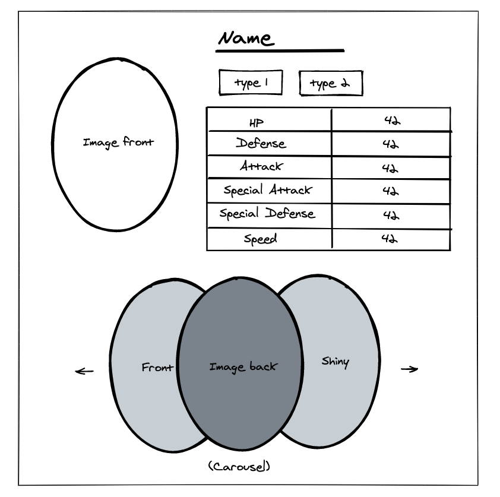
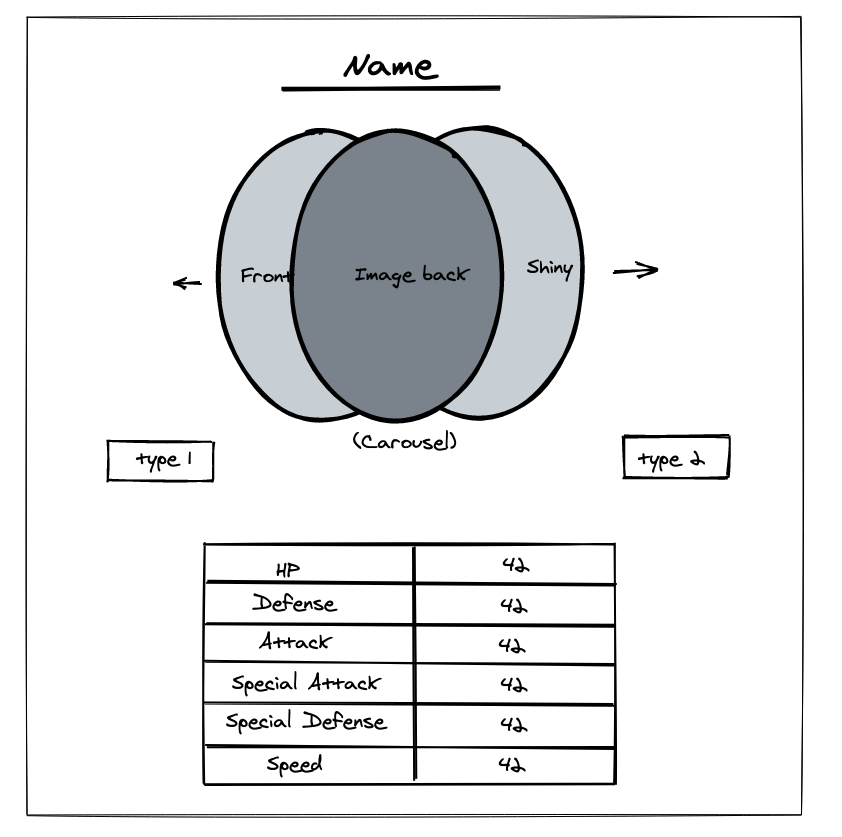

# Projet Web Iut Info module Web 2020


(A renseigner)
- Groupe N° :
- Nom Prenom
- Nom Prenom
- Nom Prenom


## Récupération du projet

Pour récuperer ce projet, vous pouvez le cloner grâce a la commande :

```cmd
git clone https://github.com/maxime-vacossin/pokeproject2020.git
```

## Initialisation du projet

Voici la liste des tâches que vous devrez exécuter pour initialiser le projet :

-   Créer une base de données (Attention à l'encodage en fonction de votre région / langue)
-   Dupliquer le fichier `config/.env.example` et le renommer en `config/.env`
-   Configurez toutes vos variables d'environnement dans ce fichier
-   Installez les dépendances du projet avec Composer (attention aux messages d'erreurs sous Windows)

Pour les plus téméraires, vous pouvez également installé les dependances utile pour jouer avec Bootstrap avec la commande suivante :

```cmd
npm install
```

A ce stade, vous avez normalement accès à la page d'acceuil de CakePhp. Si vous n'avez eu aucun message d'erreur lors de l'éxecution des commandes précédentes, tous les voyants sont au vert.
Vous connaissez désormais la structure MVC et ou se trouvent les controllers, vous arrivez donc à retrouver par vous même les différentes routes de l'application.

## Chargement des données dans la base

Pour le moment, votre base de données est vide.
Un script à été mis en place afin de charger des données directement en base de données.

Pour lancer ce script, tapez la commande suivante :

```cmd
bin/cake PokeApi -v
```

L'option -v permet d'afficher les messages de progression et/ou d'erreur.

**Félicitations ! A ce stade, vous avez 4/20**

## Gestion de projet

Ce projet peut être fait en groupe. Pas plus de 4 personnes par groupe, nous savons tous comment ça se passe quand on est trop nombreux.

Des groupes de une personne ça fonctionne aussi..

**Les groupes devront être formé avant le lundi 14/12/2020 à 21h38.**

Dés que vous aurez récupérer le projet, la premiere étape que vous devez faire (avant même la configuration de votre BDD), c'est de créer un repository Git.

Je vous invite a mettre ce repo en privé invitez ensuite vos camarades à participer à ce repo.

Vous devrez également m'ajouter à ce repo en m'invitant avec l'adresse : maxime@iteracode.fr

J'accorderais 4 points supplémentaire sur votre gestion de projet.

-   Est-ce que vous savez travailler en groupe ?
-   Est-ce que vous avez fait des branches ? Des commits pour chaque features ?
-   Est-ce que vos noms de branche et/ou de commits sont explicite ?
-   etc ..

Sachez également qu'il existe des outils pour comparer des repo entre eux et que j'aurais accès aux repo de vos camarades :)

## Demandes du client

Dans cette application, vous devrez répondre aux différents besoin du client.

Vous êtes dans un contexte de stage en entreprise (mais à la maison), vous récuperer un projet déja existant et vous avez une liste de modification a réaliser.

Le projet est une solution Open Source avec de très nombreuses page de documentation (dans toutes les langues si necessaire).

Rappelez vous que si vous recherchez le bon mot clé, vous trouverez.

### Modifier la page d'acceuil de l'application

L'url `localhost/` doit pointer vers `localhol/pokemons` mais le navigateur doit toujours afficher `localhost/`

### Charger la totalité des pokemons dans la base de données

Actuelement, seul 251 pokemons sont présent en base de données.

Modifiez le script pour faire en sorte de charger toutes les générations. (Oui, même les générations qui sont décevante ...)

### Données manquantes

Lors de l'import des données depuis la PokeApi, certaines données ont été oublié et ne sont pas en base de données.

Faites en sorte de récuperer l'image de face, l'image de dos et l'image Shiny de chaque pokemon.

### Intégration de la maquette

Le client nous à fait parvenir plusieurs maquettes pour l'affichage des information d'un pokemon.

Intégrez la maquette sur la page permettant de `visualiser` les données d'un pokemon précis.

Attention, le client souhaiterais faire du A/B Testing avec ses utilisateurs.

Les groupes 1, 3 et 5 devrons intégrer cette maquette.


Les groupes 2 et 4 devrons intégrer cette maquette.


La couleur et les choix artistiques vous appartiennent !

### Tableau de bord et Statistiques

Le client souhaiterais avoir un tableau de bord afin d'y afficher des statistique issue de la base de données.

Vous devrez donc créer un tableau de bord (Et mettre en place un lien vers celui ci dans le menu) et y afficher les données suivante :

-   Poids moyen des pokemons de la 4éme génération
-   Nombre de pokemons de type fée entre les générations 1, 3 et 7.
-   Afficher les 10 premier pokemons qui possède la plus grande vitesse

## Les conseils de dernières minutes

Parcourez l'application, vous découvrirez sont fonctionnement et peut être que certain bout de code pourrons vous aider.

Utilisez la debug bar ! 

La documentation est votre amie ! Lisez là .. Google est également jamais très loin pour vous donner des informations également.

Avant de jouer avec l'ORM pour faire des requettes, rappelez vous ce qu'on à rapidement vue en cours : les fonctions de l'orm pour créer des requettes ressemble au final beaucoup à du SQL.
Donc avant de faire du PHP, faites le en SQL et exécutez vos requettes directement depuis votre PhpMyAdmin.

## Liens utiles

PokeApi : https://pokeapi.co/api/v2/pokemon/25

CakePhp CookBook : https://book.cakephp.org/4/en/index.html

Discord : https://discord.gg/dJkXDdzF6G
